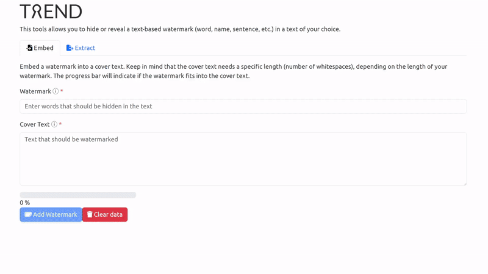

<div align="center">
  <picture>
    <source width="340" media="(prefers-color-scheme: dark)" srcset="docs/static/img/branding/logo-sub/white/innamark_logo-sub_w.svg">
    <source width="340" media="(prefers-color-scheme: light)" srcset="docs/static/img/branding/logo-sub/black/innamark_logo-sub_b.svg">
    
  </picture>
  <br />
  <br />
  
  
  
  
  <a href="https://fraunhoferisst.github.io/Innamark/">
    
  </a>
  
</div>

## Table of Contents

- [About](#about)
- [Documentation](#-documentation)
- [Structure](#-structure)
- [Getting Started](#-getting-started)
    - [Webinterface](#webinterface) 
        - [System Prerequisites](#system-prerequisites)
        - [Quick Start](#quick-start)
- [Contributing](#-contributing)
- [License](#-license)
- [Cite this Work](#-cite-this-work)
- [Team & Funding](#-team--funding)

## About
The *Invisible Watermarking* (Innamark) project offers **steganography/watermarking** solutions 
to hide data invisibly and robustly within text assets (such as documents, emails, chat 
messages, etc.).

This repository includes:
- A **Kotlin multiplatform library** that can easily be built and integrated into Kotlin, Java, 
  and JavaScript projects, offering watermark embedding and extraction functionalities
- A **webinterface** as a GUI component to embed and extract watermarks
- A **command line interface (CLI)** as a terminal solution for watermark embedding and extraction

Key features of Innamark:
- **Invisible**: Humans can't distinguish the original text from a watermarked text
- **Robust**: Survives copy & paste and format changes in different applications
- **Length-preserving**: The character count remains unchanged, without using zero-width characters

The following example uses our webinterface and Kotlin library to hide the "Innamark" watermark 
inside a text, send it via email, and verify and extract the watermark afterward on the 
recipient side:



The core Innamark watermarking algorithm is developed by German researchers from the [Fraunhofer 
Institute for Software and Systems Engineering](https://www.isst.fraunhofer.de/en.html), 
published as a [scientific journal paper](https://doi.org/10.1109/ACCESS.2025.3583591), and 
applied for a [German](https://patents.google.com/patent/DE102023125012A1) and [international 
patent](https://patents.google.com/patent/WO2025056772A1/en).

## 📖 Documentation

All information from usage to development are collected and provided in our
[documentation](https://fraunhoferisst.github.io/Innamark/).

## 📁 Structure

This project uses a [monolithic repository approach](https://en.wikipedia.org/wiki/Monorepo) and
consists of different parts, located in different subfolders. The heart is a **watermarker
library**, located in the `watermarker` folder, used by other components like the CLI
tool or the webinterface shipped with this repo. Every part has its own `README` file to get 
further information.

### Subfolder Overview

- **cli**: A command line interface to enable watermarking directly via a shell/terminal
- **docs**: The [documentation](https://fraunhoferisst.github.io/Innamark/) of all parts based 
  on the [Docusaurus](https://github.com/facebook/docusaurus) framework
- **samples**: Different examples of watermarked and non-watermarked files, mainly used for tests
- **watermarker**: The heart part of the repository: A Kotlin watermarker library for hiding 
  text (a watermark) inside a cover text. The library works on the JVM (Java) and JavaScript (JS)
  platform
- **webinterface**: A frontend / GUI to use the watermarking inside a browser, build with
  the [KVision](https://github.com/rjaros/kvision) framework

## 🚀 Getting Started

Detailed getting started guides are described for every component in their dedicated `README`
file, located in the corresponding subfolders.

### Webinterface
In the following, an easy start of the webinterface that uses our Kotlin watermarker library is 
described.

#### System Prerequisites

The following things are needed to run the webinterface:

- [Docker](https://docs.docker.com/engine/install/)
- [Docker Compose](https://docs.docker.com/compose/install/)

#### Quick Start

To run the webinterface, just clone the repo locally and run the `docker-compose.yml` file in the
root directory of the project:

```shell
$ git clone https://github.com/FraunhoferISST/Innamark.git
$ cd Innamark
$ docker compose up
```

After the startup finished, try to visit the webinterface at http://localhost:8080

## ✍️ Contributing

Contributions to this project are greatly appreciated! Every contribution needs to accept the
Corporate Contributor License Agreement, located in the `CLA.md` file. For more details, see the
`CONTRIBUTING.md` file.

## ⚖️ License

This work is licensed under the Fraunhofer License (on the basis of the MIT license). See
`LICENSE` file for more information.

> [!CAUTION]
> There are pending German and international (PCT) patent applications with the publication numbers
> [DE102023125012A1](https://patents.google.com/patent/DE102023125012A1) and
> [WO2025056772A1](https://patents.google.com/patent/WO2025056772A1/en). In order to use the 
> Innamark watermarker software in the form published here, a patent license is required in 
> addition to the license for the software. See `LICENSE` for more information. In case of any 
> questions or uncertainties, please contact us at innamark@isst.fraunhofer.de.

## 📝 Cite this Work

The main concepts of the core Innamark watermarking algorithm are presented and compared against
related work in an open access _IEEE Access_ journal publication:

- Hellmeier et al., "Innamark: A Whitespace Replacement Information-Hiding Method", 2025, IEEE
  Access, vol. 13, pp. 123120-123135, doi: [10.1109/ACCESS.2025.3583591](https://doi.org/10.1109/ACCESS.2025.3583591)

To cite the journal article in LaTeX/BibTeX/BibLaTeX:

```bibtex
@article{Hellmeier.2025,
    author = {Hellmeier, Malte and Norkowski, Hendrik and Schrewe, Ernst-Christoph and Qarawlus, Haydar and Howar, Falk},
    title = {{Innamark: A Whitespace Replacement Information-Hiding Method}},
    year = {2025},
    journal = {{IEEE Access}},
    volume = {13},
    pages = {123120--123135},
    issn = {2169-3536},
    doi = {10.1109/ACCESS.2025.3583591}
}
```

## 👨👩 Team & Funding

### Active Members

- [Malte Hellmeier](https://github.com/mhellmeier) (Fraunhofer ISST)
- [Haydar Qarawlus](https://github.com/hqarawlus) (Fraunhofer ISST)
- [Joris Schiphorst](https://github.com/Schiphorst-ISST) (Fraunhofer ISST)
- [Ernst-Christoph Schrewe](https://github.com/eschrewe) (Fraunhofer ISST)

### Alumni Members

- [Hendrik Norkowski](https://github.com/hnorkowski)
- [David Gemen](https://github.com/gemdav)

### Funding
The initial project version was created within the scope of
the [Center of Excellence Logistics and It](https://ce-logit.com/), also supported by the
[Fraunhofer Cluster of Excellence Cognitive Internet Technologies CCIT](https://www.cit.fraunhofer.de/en.html)
and [AHEAD as Fraunhofer's Deeptech Incubator](https://www.ahead.fraunhofer.de/en.html).
