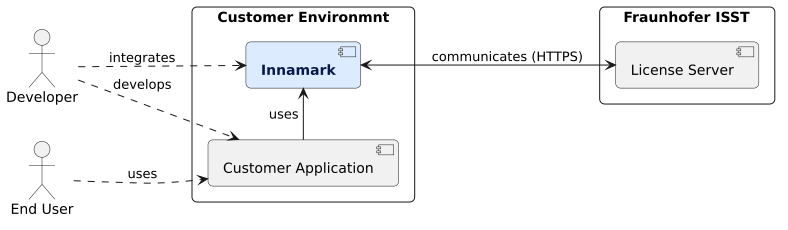

<!--
 Copyright (c) 2026 Fraunhofer-Gesellschaft zur Förderung der angewandten Forschung e.V.

 This work is licensed under the Fraunhofer License (on the basis of the MIT license)
 that can be found in the LICENSE file.
-->

# Context and Scope

| Element                                | Description                                                                                                                                                                                                                                                                                                                                                                         |
|----------------------------------------|-------------------------------------------------------------------------------------------------------------------------------------------------------------------------------------------------------------------------------------------------------------------------------------------------------------------------------------------------------------------------------------|
| **Innamark** (system)                  | Our ecosystem of watermarking tools and software (library, webinterface, CLI tool, API, ...)                                                                                                                                                                                                                                                                                        |
| **Customer Appliaction** (system)      | An external application for that customer, aiming to integrate or use watermarking functionalities by either integrating Innamark directly inside it (e.g., via the watermarking library) or by calling or using external services (e.g., a REST API).                                                                                                                              |
| **License Server** (system)            | Since Innamarks core functionality is patent-pending, a patent license is needed in various cases (see [LICENSE](https://github.com/FraunhoferISST/Innamark/blob/main/LICENSE)). The used Innamark tools by the customer communicate via HTTPS with the license server, to check if a license exist and if it is valid. Only checks and usage data is transfered, no customer data. |
| **Customer Environment** (environment) | Applications running inside the customer environment (can be in the cloud or on premise). Here, Innamark and the customer application are under full control of the customer, while no customer data leaves these boundaries.                                                                                                                                                       |
| **Fraunhofer ISST** (environment)      | Applications running on 24/7 available servers of the Fraunhofer ISST (currently: the license server).                                                                                                                                                                                                                                                                              |
| **Developer** (user)                   | A person on the customer side, developing specific applications and aiming to integrate Innamark watermarking functionalities into the IT landscape.                                                                                                                                                                                                                                |
| **End User** (user)                    | An end user, using the systems and applications of the customer. While Innamark is mostly directly integrated, an end user mostly didn't know or notice that Innamark watmermarking functionalities are used.                                                                                                                                                                       |
