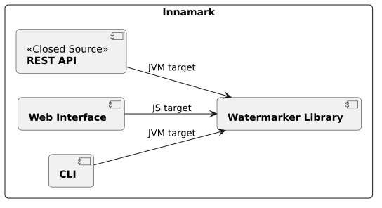
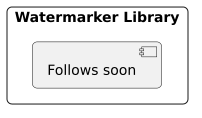
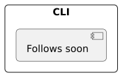
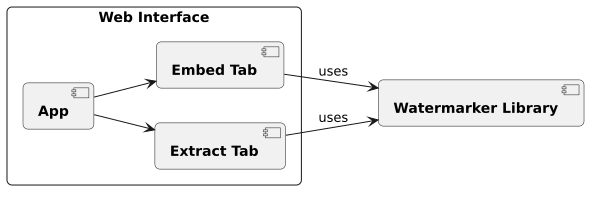

<!--
 Copyright (c) 2026 Fraunhofer-Gesellschaft zur Förderung der angewandten Forschung e.V.

 This work is licensed under the Fraunhofer License (on the basis of the MIT license)
 that can be found in the LICENSE file.
-->

# Building Block View

## Level 1: Innamark

Innamark is not one single component or application. It is a full ecosystem of various building blocks,
offering different functionalities.

### Contained Building Blocks

| Building Block                                          | Description                                                                                         |
|---------------------------------------------------------|-----------------------------------------------------------------------------------------------------|
| [**Watermarker Library**](#level-2-watermarker-library) | A Kotlin multiplatform libray, offering watermark embedding and extraction functionalities.         |
| [**CLI**](#level-2-cli)                                 | A command line interface (CLI) as a terminal solution for watermark embedding and extraction.       |
| [**Web Interface**](#level-2-web-interface)             | A graphical user interface (GUI) to embed and extract watermarks.                                   |
| [**REST API**](#level-2-rest-api-blackbox) (closed source)                        | A closed-source implementation of an API, offering watermarking embedding and extraction endpoints. |

## Level 2: Watermarker Library

### Purpose / Responsibility

The watermarker library is the hearth of Innamark, containing the main watermark logic and
functionalities. It is written as a [Kotlin multiplatform](https://kotlinlang.org/multiplatform/)
library and thus able to be built for Java (JVM) and JavaScript (JS) applications to integrate 
watermarking into backend and frontend applications. The library is highly flexible and 
extensible and comes with various utilities, interfaces, and builders. It aims to increase the 
developer experience to easily integrate Innamarks watermarking mechanisms into other applications.

### Interfaces

_Follows soon._

## Level 2: CLI

### Purpose / Responsibility

The command line interface (CLI) is based on 
the [Kotlin CLI parser kotlinx-cli](https://github.com/Kotlin/kotlinx-cli), aiming to bring 
watermarking functionalities into the terminal. It is able to embed and extract watermarks from 
Strings directly in the terminal and files. The CLI tool is easy to extand with custom 
commands and arguments. Under the hood, it uses 
the [Innamark watermark library](#level-2-watermarker-library) with the Java build target.

### Interfaces

_Follows soon._

## Level 2: Web Interface

### Purpose / Responsibility

The Web Interface is based on the [KVision web framework for Kotlin/JS](https://kvision.io/), 
aiming to create a GUI running in the browser to easily embed and extract watermarks. It 
consists of a single-page design with two tabs: One for watermark embeeding and one for 
watermark extraction. It is only able to embed text-watermarks into existing cover texts and 
offers configuration possibilities for different watermark types (e.g., compress the watermark, 
add a hash to verify the watermark, etc.). Under the hood, it uses the [Innamark watermark 
library](#level-2-watermarker-library) with the JavaScript (JS) build target and can be seen as a 
frontend for it.

### Interfaces

_Follows soon._

## Level 2: REST API (Blackbox)

### Purpose / Responsibility

The REST API is a closed source implementation, offering various API endpoints to watermark existing
text and files and thus not further described in this documentation.
